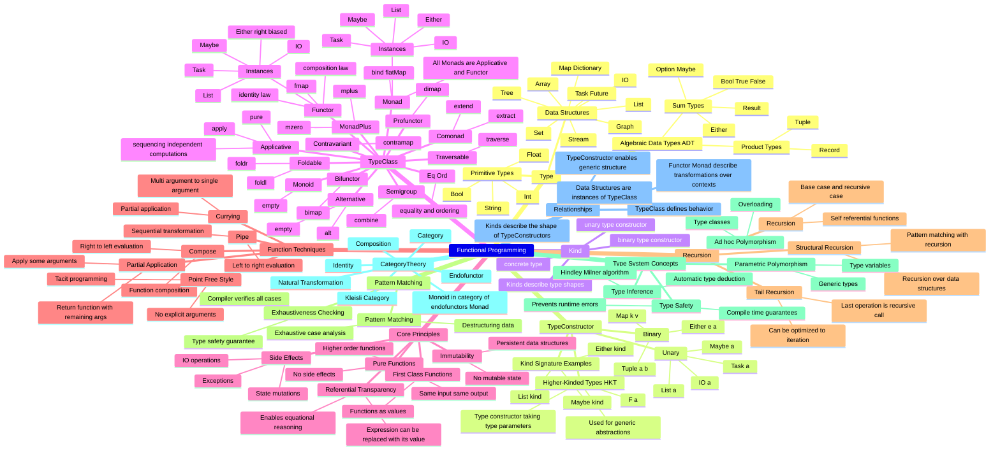

```mermaid
mindmap
  Functional Programming
    Type
      Primitive Types
        Int
        Float
        String
        Bool
      Algebraic Data Types ADT
        Product Types
          Tuple
          Record
        Sum Types
          Option Maybe
          Either
          Result
          Bool True False
      Data Structures
        List
        Array
        Stream
        IO
        Task Future
        Set
        Tree
        Graph
        Map Dictionary

    TypeConstructor
      Unary
        Maybe a
        List a
        IO a
        Task a
      Binary
        Either e a
        Tuple a b
        Map k v
      Higher-Kinded Types HKT
        F a
        Type constructor taking type parameters
        Used for generic abstractions
      Kind Signature Examples
        Maybe kind
        List kind
        Either kind

    Kind
      concrete type
      unary type constructor
      binary type constructor
      Kinds describe type shapes

    TypeClass
      Functor
        fmap
        identity law
        composition law
        Instances
          Maybe
          Either right biased
          List
          IO
          Task
      Applicative
        pure
        apply
        sequencing independent computations
      Monad
        bind flatMap
        All Monads are Applicative and Functor
        Instances
          Maybe
          Either
          List
          IO
          Task
      Foldable
        foldl
        foldr
      Traversable
        traverse
      Bifunctor
        bimap
      Semigroup
        combine
      Monoid
        empty
      Eq Ord
        equality and ordering
      Contravariant
        contramap
      Profunctor
        dimap
      Comonad
        extract
        extend
      Alternative
        empty
        alt
      MonadPlus
        mzero
        mplus

    Core Principles
      Immutability
        No mutable state
        Persistent data structures
      Pure Functions
        No side effects
        Same input same output
      Referential Transparency
        Expression can be replaced with its value
        Enables equational reasoning
      Side Effects
        IO operations
        State mutations
        Exceptions
      First Class Functions
        Functions as values
        Higher order functions

    Function Techniques
      Compose
        Function composition
        Right to left evaluation
      Pipe
        Left to right evaluation
        Sequential transformation
      Currying
        Multi argument to single argument
        Partial application
      Partial Application
        Apply some arguments
        Return function with remaining args
      Point Free Style
        Tacit programming
        No explicit arguments

    Recursion
      Recursion
        Self referential functions
        Base case and recursive case
      Tail Recursion
        Last operation is recursive call
        Can be optimized to iteration
      Structural Recursion
        Recursion over data structures
        Pattern matching with recursion

    Pattern Matching
      Pattern Matching
        Destructuring data
        Exhaustive case analysis
      Exhaustiveness Checking
        Compiler verifies all cases
        Type safety guarantee

    Type System Concepts
      Type Inference
        Automatic type deduction
        Hindley Milner algorithm
      Type Safety
        Compile time guarantees
        Prevents runtime errors
      Parametric Polymorphism
        Generic types
        Type variables
      Ad hoc Polymorphism
        Type classes
        Overloading

    CategoryTheory
      Category
      Endofunctor
      Natural Transformation
      Monoid in category of endofunctors Monad
      Kleisli Category
      Composition
      Identity

    Relationships
      TypeClass defines behavior
      Data Structures are instances of TypeClass
      TypeConstructor enables generic structure
      Kinds describe the shape of TypeConstructors
      Functor Monad describe transformations over contexts
```